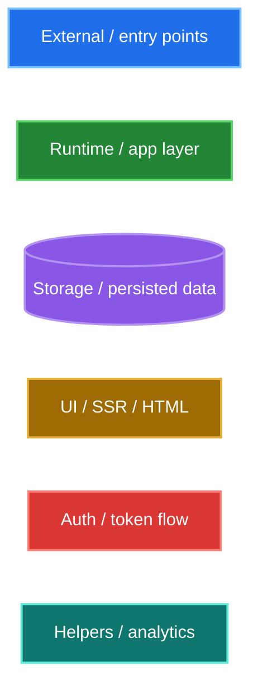
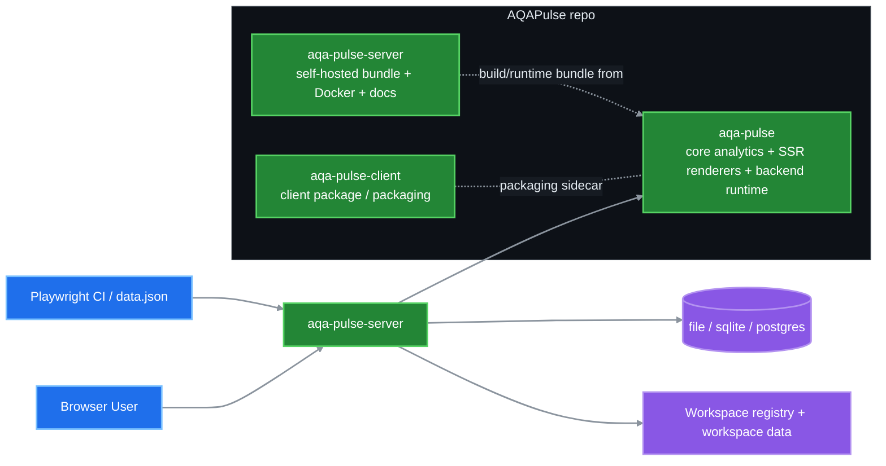
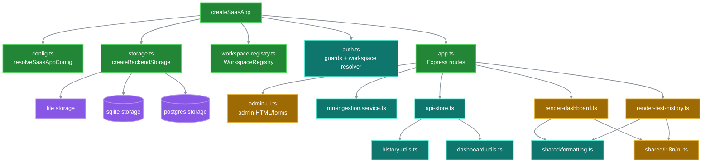
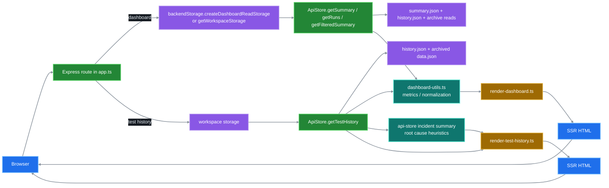
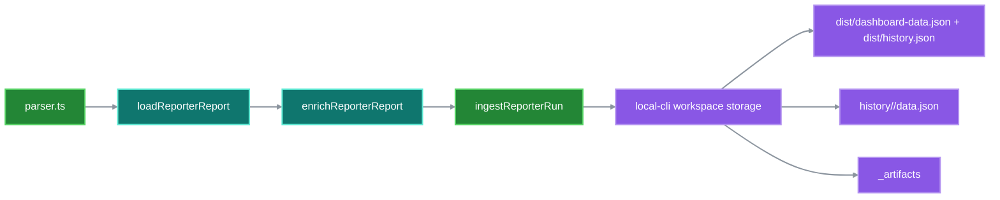
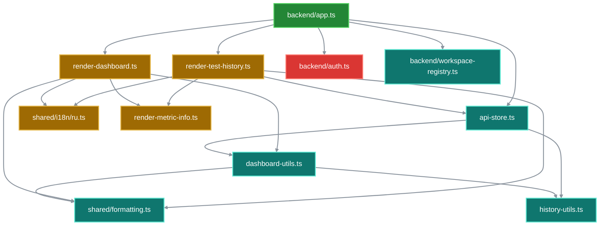
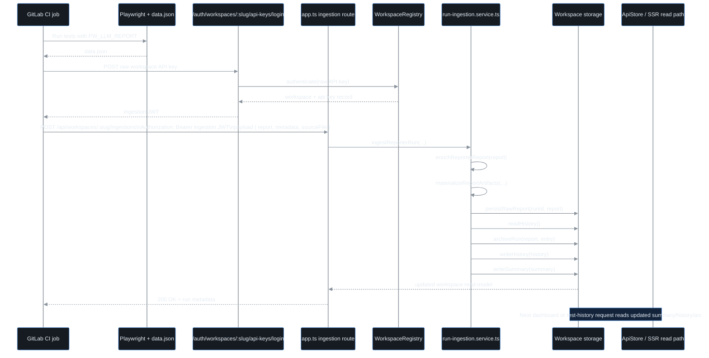
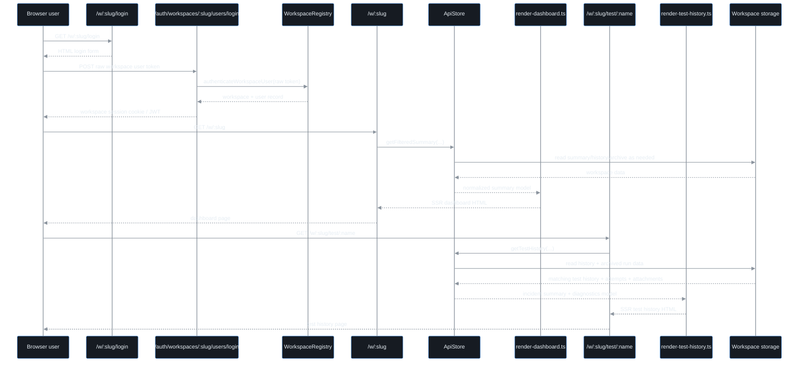

# AQA Pulse Architecture Diagrams

Ниже собраны block-схемы по текущему состоянию проекта: пакеты, backend runtime, ingestion, auth и SSR/read path.

Палитра ниже адаптирована под тёмную тему: фон, подписи, границы и стрелки выставлены явно, чтобы схемы не терялись на dark background.

## Legend / Color Map



## 1. Repo / Package Overview



## 2. Self-Hosted Runtime Modules



## 3. Ingestion Pipeline

```mermaid
%%{init: {
    "theme": "base",
    "themeVariables": {
        "background": "#0d1117",
        "primaryColor": "#161b22",
        "primaryTextColor": "#e6edf3",
        "primaryBorderColor": "#3d444d",
        "secondaryColor": "#161b22",
        "secondaryTextColor": "#e6edf3",
        "secondaryBorderColor": "#3d444d",
        "tertiaryColor": "#161b22",
        "tertiaryTextColor": "#e6edf3",
        "tertiaryBorderColor": "#3d444d",
        "lineColor": "#8b949e",
        "textColor": "#e6edf3",
        "mainBkg": "#161b22",
        "clusterBkg": "#0d1117",
        "clusterBorder": "#3d444d",
        "edgeLabelBackground": "#161b22"
    }
}}%%
flowchart LR
        INPUT[ReporterRoot\nfrom CI / parser / API] --> ENRICH[dashboard-utils.ts\nenrichReporterReport]
        ENRICH --> INGEST[run-ingestion.service.ts\ningestReporterRun]

        INGEST --> SUM0[buildDashboardSummary\nsummaryWithoutHistory]
        SUM0 --> ENTRY[history-utils.ts\nbuildHistoryEntryId + nextHistoryEntry]

        INGEST --> ART[materializeReportArtifacts]
        ART --> RAW[persistRawReport]
        ART --> ARCH[archiveRun]

        ENTRY --> HISTREAD[readHistory]
        HISTREAD --> APPEND[appendHistoryEntry]
        APPEND --> HISTWRITE[writeHistory]

        ARCH --> METRICS[buildAdvancedMetrics]
        METRICS --> SUM1[buildDashboardSummary\nfinal summary]
        SUM1 --> SUMMARYWRITE[writeSummary]

        SUMMARYWRITE --> OUT[workspace dist/history/archive/raw-reports/artifacts]
        HISTWRITE --> OUT
        RAW --> OUT

        classDef external fill:#1f6feb,stroke:#79c0ff,color:#ffffff,stroke-width:2px;
        classDef runtime fill:#238636,stroke:#56d364,color:#ffffff,stroke-width:2px;
        classDef data fill:#8957e5,stroke:#b392f0,color:#ffffff,stroke-width:2px;
        classDef util fill:#0f766e,stroke:#5eead4,color:#ffffff,stroke-width:2px;

        class INPUT external;
        class INGEST,SUM0,ENTRY,ART,APPEND,METRICS,SUM1 runtime;
        class RAW,ARCH,HISTREAD,HISTWRITE,SUMMARYWRITE,OUT data;
        class ENRICH util;
        linkStyle default stroke:#8b949e,stroke-width:2px;
```



## 4. Auth / Token Exchange Model

```mermaid
%%{init: {
    "theme": "base",
    "themeVariables": {
        "background": "#0d1117",
        "primaryColor": "#161b22",
        "primaryTextColor": "#e6edf3",
        "primaryBorderColor": "#3d444d",
        "secondaryColor": "#161b22",
        "secondaryTextColor": "#e6edf3",
        "secondaryBorderColor": "#3d444d",
        "tertiaryColor": "#161b22",
        "tertiaryTextColor": "#e6edf3",
        "tertiaryBorderColor": "#3d444d",
        "lineColor": "#8b949e",
        "textColor": "#e6edf3",
        "mainBkg": "#161b22",
        "clusterBkg": "#0d1117",
        "clusterBorder": "#3d444d",
        "edgeLabelBackground": "#161b22"
    }
}}%%
flowchart TD
        ADMINRAW[Admin token\nAQA_PULSE_ADMIN_TOKEN] --> ADMINLOGIN[POST /auth/admin/login]
        ADMINLOGIN --> ADMINJWT[Admin JWT / session cookie]
        ADMINJWT --> ADMINROUTES[/admin + /api/workspaces*]

        APIKEY[Workspace API key\nraw token] --> APIKEYLOGIN[POST /auth/workspaces/:slug/api-keys/login]
        APIKEYLOGIN --> INGJWT[Ingestion JWT\nscope workspace:ingest]
        INGJWT --> INGROUTE[POST /api/workspaces/:slug/ingestions]

        USERTOKEN[Workspace user token\nraw token] --> USERLOGIN[POST /auth/workspaces/:slug/users/login\nor /w/:slug/login]
        USERLOGIN --> USERJWT[Workspace JWT / session cookie\nscope workspace:read]
        USERJWT --> READROUTES[/w/:slug + /api/workspaces/:slug/*]

        ADMINJWT -. bypass read restrictions .-> READROUTES

        classDef auth fill:#da3633,stroke:#ff7b72,color:#ffffff,stroke-width:2px;
        classDef runtime fill:#238636,stroke:#56d364,color:#ffffff,stroke-width:2px;

        class ADMINRAW,ADMINJWT,APIKEY,INGJWT,USERTOKEN,USERJWT auth;
        class ADMINLOGIN,ADMINROUTES,APIKEYLOGIN,INGROUTE,USERLOGIN,READROUTES runtime;
        linkStyle default stroke:#8b949e,stroke-width:2px;
```

## 5. Dashboard / Test History Read Path



## 6. Local CLI Parse Flow



## 7. Helper / Utility Relationships



## 8. Sequence: GitLab CI Upload -> Ingestion -> Dashboard Update



## 9. Sequence: User Login -> Workspace Read -> Test History

